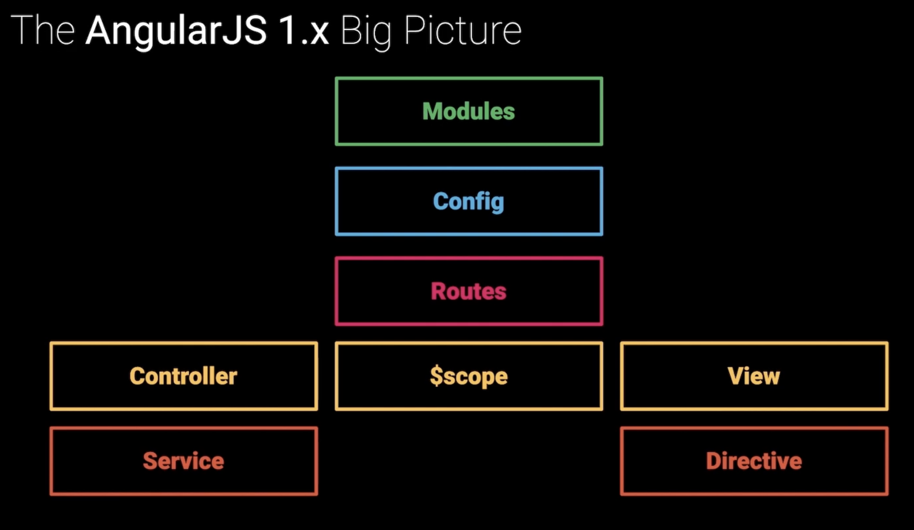
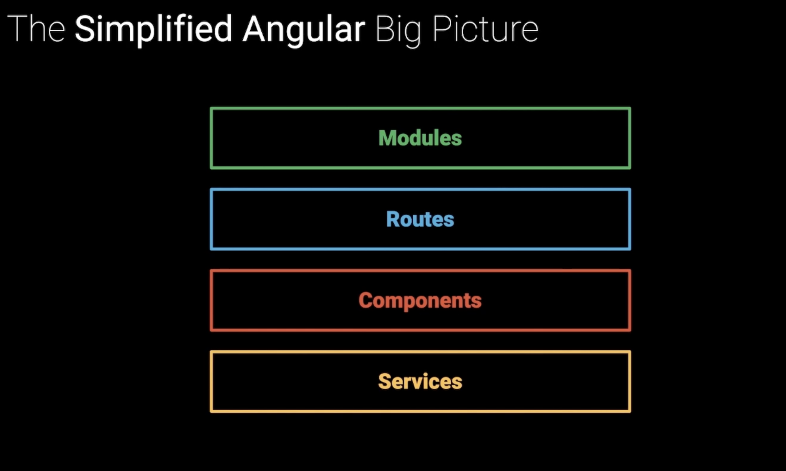

### Why Angular

1. Angular follows common and familiar enterprise patterns and conventions. This means if you have a background in Java or dotnet, and you're familiar or comfortable with the class based approach, you'll feel right at home with Angular. This can be seen from the fact that Angular is built on TypeScript, which is a superset of JavaScript that adds static typing and class based object oriented programming to the language.

2. Angular is a batteries included framework. This means that you don't have to worry about the plumbing. Angular takes care of the plumbing for you. This includes things like routing, state management, and data fetching. This means that you can focus on the business logic of your application and not worry about the plumbing. Unlike React which needs a routing library like React Router, state management library like Redux, and data fetching library like Apollo, Angular takes care of all of this for you.

3. Ships with tooling to accelerate the developer workflow. Angular CLI and NX Dev Tool.

4. Rich and Vibrant ecosystem.

5. Proven track record.





### Modules

Two flavours inside Angular:

- ES6 Modules:
  - Organization at a language level.
  - Uses ES6 Module Syntax.
  - Modules export things that other modules can import.

```js
import { Component, OnInit } from '@angular/core';
import { ItemService, Item } from '../shared';

@Component({
  selector: 'app-items',
  templateUrl: './items.component.html',
  styleUrls: ['./items.component.css']
})
export class ItemsComponent implements OnInit {}
```

- @NgModule:
  - Organization at a framework level.
  - Tells Angular how to configure itself so that it knows what exists and how it needs to fit together.
  - `declarations` - Define view classes that are available to the module.
  - `imports` - Define a list of modules that the module needs.
  - `providers` - Define a list of services the module makes available.
  - `exports` - Define a list of modules the module makes available.
  - `bootstrap` - Define the component that should be bootstrapped.

```js
@NgModule({
    // Here's the modules we're importing
    imports: [
        BrowserModule, 
        AppRoutingModule, 
        BrowserAnimationsModule, 
        MaterialModule, 
        HttpClientModule
    ],
    // Here's the components we're declaring
    declarations: [AppComponent, HomeComponent],
    // Here's the providors that we want to consume
    providers: [ 
        AuthService, 
        NotificationService
    ],
    // We're going to bootstrap on the AppComponent
    bootstrap: [AppComponent]
})
export class AppModule {}
```

At the very highest level, when we're spinning this application up, hen we tell Angulat to go ahead and bootstrap the AppModule:

```js
import { platformBrowserDynamic } from '@angular/platform-browser-dynamic';
import { enableProdMode } from '@angular/core';
import { environment } from './environments/environment';
import { AppModule } from './app';

if (environment.production) {
  enableProdMode();
}

platformBrowserDynamic().bootstrapModule(AppModule);
```

Like React, Angular also consists of a tree shaped component hierarchy with the root module at the top which is the entry point (root `div` in React) and every other components as it's branches and leaves. This helps in promoting a unidirectional data flow from top to bottom (`props` in React). But then if there's an event, that can be propagated up the tree (Event Bubbling).

### Getting Started

Like Create React App, we have Angular CLI. Angular CLI enables us to use ng which is used for a lot of functionalities which will come later.

```bash
npm install -g @angular/cli
```

To create a new app:

```bash
ng new my-first-project
```

### Components

Like React, Angular also has a reusable component based structure for creating web apps.

A component consists of three things:

1. Component Class: Handles the data and functionality.
2. HTML Template: Determines the structure of UI. (`app.component.html`)
3. Component-specific styles: Defines the look and feel. (`app.component.css`)

We can write global styles in `styles.css`.

We use `class` to bind classes to the template.

```html
<div class="product" [class.selected]="product.isSelected"></div>
```

In React we do the same by:

```jsx
<div className={`product ${product.isSelected ? 'selected' : ''}`}></div>
```

### State

The state of a component is the data that it holds. In Angular, we can store the state of a component in a class property. We can then use this property in the template to display the data. It is stored in `app.component.ts`:

```js
export class AppComponent {
  newMemberName: string = '';
  members: string[] = [];
}
```

### Event Handling

### Directives

In angular, we have structural directives which are used to change the structure of the DOM. Structural directives are denoted by `*` in the template. For example, `*ngIf` is used to conditionally render a component.

```html
<div *ngIf="isUserLoggedIn">Welcome to the app</div>
```

In React we do the same by:

```jsx
{isUserLoggedIn && <div>Welcome to the app</div>}
```

Angular also has a similar syntax for conditional rendering.

```html
<div [hidden]="!isUserLoggedIn">Welcome to the app</div>
```

For repeating a component, we use `*ngFor` in Angular.

```html
<div *ngFor="let product of products">
</div>
```

We do the same in React by:

```jsx
{products.map(product => <div>{product}</div>)}
```

Interpolation is used to bind data to the template. We use `{{}}` to do the same.

```html
<div>{{product}}</div>
```

We do the same in React by:

```jsx
<div>{product}</div>
```
