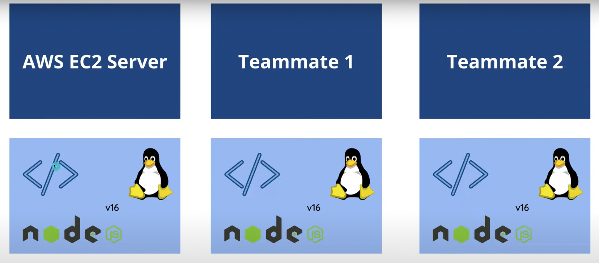
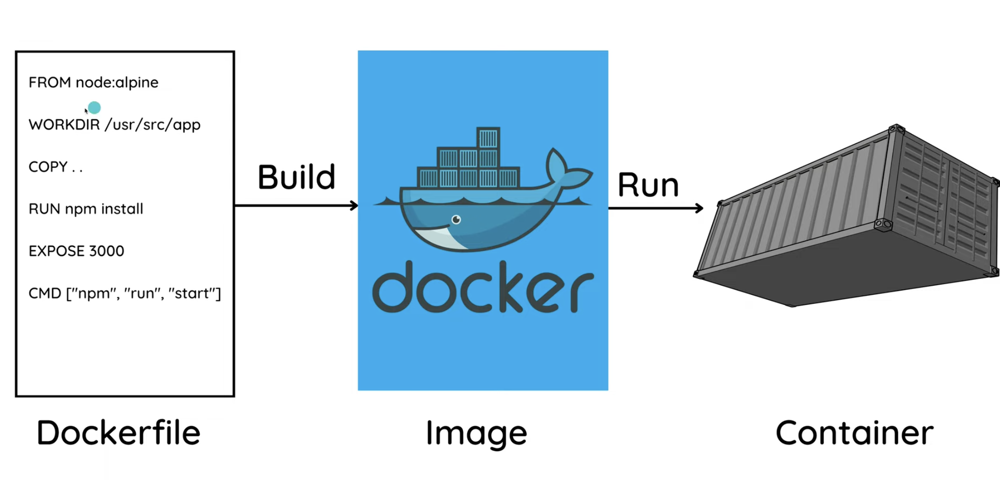
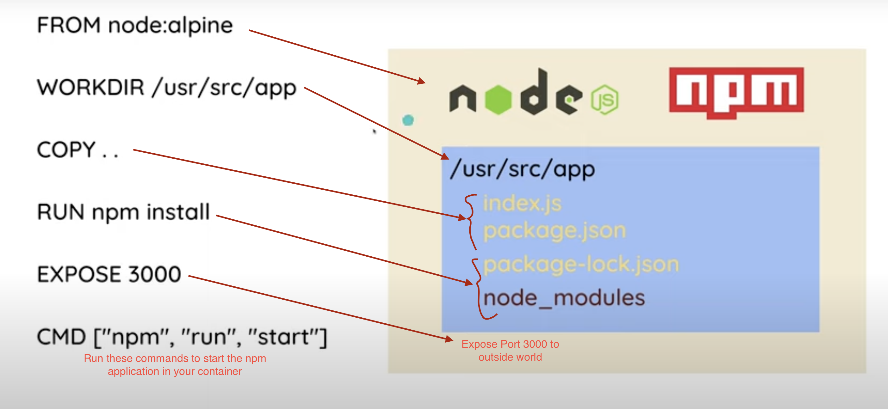

Docker provides a way to run an application in isolation with all of its dependencies.

Imagine you have created a Full Stack React and Java application that uses React, node v16, Linux OS, Java 17, Spring Boot and a PostGres Database. You can run the application on your computer, but to run it on other computers you need to install all the dependencies with the exact versions the way it is on your computer and some of those machines can't afford to upgrade their systems as they might be working on legacy projects and machines. Also, some of them might not have Linux based operating systems.

This is where Docker comes in. Docker provides a way to run an application in isolation with all of its dependencies.

It is a containerization platform that allows you to package an application into containers with all of its dependencies into a standardized unit (combining application source code, with the OS libraries and dependencies) which is required to run that code in any environment.

The below image shows containers running in isolation in separate environments regardless of what those different environment contains:



If we want to connect our application to a PostGres database, we can do that by creating a container for the database and then connecting our application to that container.


## Building Images and Running Containers

Before we start containerizing our application, imagine we have a simple node application. We can run it on our computer by running the following command:

```bash
node index.js
```

or if we have a `package.json` file, we can run it by running the following command:

```bash
npm start
```

by defining a `start` script in your `package.json` file.

```json
{
  "name": "node-app",
  "version": "1.0.0",
  "description": "",
  "main": "index.js",
  "scripts": {
    "start": "node index.js"
  },
  "keywords": [],
  "author": "",
  "license": "ISC",
  "dependencies": {
    "express": "^4.18.2"
  }
}
```

There are two major things that we need to do to run our application:

1. Install the dependencies (node, npm, express)
2. Run the application (npm run start)

The Dockerfile is a text document that contains all the commands a user could call on the command line to assemble an image. Using docker build users can create an automated build that executes several command-line instructions in succession.

This dockerfile is used to create/build an image. The image contains all the instructions to run our application as specified above. We then use these images to run containers.



```dockerfile
# Specifies a base image
# This will install all the dependencies to run a node application
# These base images are downloaded through an image registry
# In this case, it's Docker Hub
# We can specify different registries in the FROM command as well
# image:tag or a version number
FROM node:alpine

# Specifies the working directory
# Creates the directory if it doesn't exist in our container
# All the following commands will be executed in this directory
# It is nice to have a folder structure like this in our container so that it doesn't clash with other files in the container
WORKDIR /usr/src/app

# Copies all the files from the current directory to the working directory in the container
# First dot is the current directory which is the directory where the Dockerfile is located
# Second dot is the working directory in the container
COPY . .

# Installs all the npm dependencies
RUN npm install

# Exposes a port to the outside world
EXPOSE 3000

# Runs the command to start the application in our container
CMD [ "npm", "run", "start" ]
```



To build an image, we run the following command:

```bash
docker build -t node-app .
```

`-t` is used to tag the image with a name. The name is used to run the container later.

`.` is the current directory where the Dockerfile is located.

To list all available images, we run the following command:

```bash
docker images
```

To run a container, we run the following command:

```bash
docker run --name <container-name> <image-name>
```

`--name` is used to name the container with the name as `<container-name>`.

`<image-name>` is the name of the image we want to run.

Now the application would be running on port 3000 in our container. We can't access it from our browser as it is running in a container. To access it from our browser, we need to map the port 3000 in our container to a port in our computer.


To make sure we can access the application from our browser, we need to map the port 3000 in our container to a port in our computer. We can do that by running the following command:

```bash
docker run --name <container-name> -p <port-in-computer>:<port-in-container> <image-name>
```

`-p` is used to map the port in our computer to the port in our container.


When you make some changes to your application, you need to rebuild the image and run the container again. To stop the container, we run the following command:

```bash
docker stop <container-name>
```

This gradually stops the container. To stop the container immediately, we run the following command:

```bash
docker kill <container-name>
```

To remove the container, we run the following command:

```bash
docker rm <container-name>
```

To build the image again, we run the following command:

```bash
docker build -t <image-name>:v2 .
```

Whenever we make changes to our code, we need to rebuild the image and run the container again. This is highly inefficient if we're working through a big change. To make this process easier, we can use bind mounts.

Bind mounts allow us to map a directory in our computer to a directory in our container. This way, we can make changes to our code in our computer and the changes will be reflected in our container.

The command to run a container with bind mounts is as follows:

```bash
docker run --name <container-name> -p <port-in-computer>:<port-in-container> -v <directory-in-computer>:<directory-in-container> <image-name>
```

`-v` is used to map a directory in our computer to a directory in our container.

e.g. `-v $(pwd):/usr/src/app`: This maps the current directory in our computer to the working directory in our container. `pwd` is the present working directory. After the `:` is the directory in our container. This, however, only works on Linux and Mac. For Windows, we need to use the absolute path of the directory or use `%cd%` instead of `pwd`.

This however will replace the entire content in our container with the directory in our computer. For node applications, this means that it will remove the `node_modules` folder in our container and replace it with the `node_modules` folder in our computer. This is not what we want. We want to keep the `node_modules` folder in our container and only replace the files in our container with the files in our computer. To do this, we need to use a different command.

If we want to keep the directory in our container and add only the contents in our computer to it, we can use anonymous volumes.

Anonymous volumes are created when we run a container and are deleted when we stop the container. To use anonymous volumes, we run the following command:

```bash
docker run --name my-node-app -p 3000:3000 -v $(pwd):/usr/src/app -v /usr/src/app/node_modules nodeapp
```

This will create an anonymous volume for the `node_modules` folder in our container. This way, we can keep the `node_modules` folder in our container and only replace the files in our container with the files in our computer.

The Docker containers are their own environments. We can access the container's shell by running the following command:

```bash
docker exec -it <container-name> sh
```

`-it` is used to run the container in interactive mode.

`sh` is used to run the shell in the container.

Creating the anonumous volume does link your container to your local machine. Even though the changes you do in your local machine will be reflected in the container, which can be verified from the above command, we still can't see the changes in the web browser here.

For that we might need to install a `nodemon` package in our container. This package will automatically restart the server whenever we make changes to our code.

Then we need to have two docker files. One for the production and one for the development. The development docker file will have the `nodemon` package installed and the production docker file will not have the `nodemon` package installed.

## Optimize Docker Workflow

In a node application, you might have some files that you don't want to copy in your docker container e.g. `node_modules` folder or the `package-lock.json` file. To avoid this, we can use a `.dockerignore` file. This file will contain the files and folders that we don't want to copy in our docker container.

```.dockerignore
node_modules
Dockerfile
Dockerfile.dev
package-lock.json
```

During the build process, docker will ignore the files and folders mentioned in the `.dockerignore` file. You can `exec` into the container and verify that the files and folders are not present in the container.
