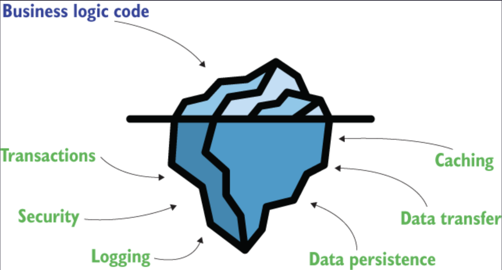
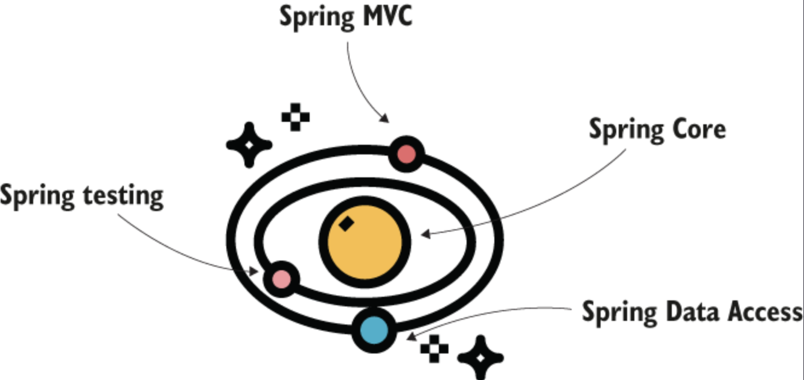

## Application Framework

Spring Framework is an Application framework of the Java ecosystem. An application framework is a set of common functionalities that provides a foundation structure for developing an application. They reduce the effort of writing an application by making sure that you don't have to write all the program code from scratch.

## Why use frameworks?

- An application framework is a set of functionalities on top of which we build our applciations.
- It provides a vast range of tools and functionalites that help us build applications. However, we can pick and choose which ones to use based on the requirements of our application.
- Frameworks are a bunch of reusable code that coders have written in multiple applications.

For a vast range of applications these days, the business logic might be the tip of the iceberg, but there are a lot of other things that we need to do to build an application. Some set of similar requirements are the following:

- Logging errors, warnining and info messages.
- Using transactions to process data changes.
- Security features.
- Ways to communicate with other applications.
- Ways to improve performance e.g. caching, data compression etc.

The business logic is the one that differentiates one application from another, but they both need data storing, data transfer, logging, security configurations, probably caching, and so on. Various applications can reuse these non-business implementations. It's not efficient to rewrite all the same functionalities for each application.

- You spare a lot of time and money by reusing something rather than developing it yourself.
- An existing implementation that many apps already use has fewer chances to introduce bugs, as others have tested it.
- You benefit from the advice of a community because you now have a lot of developers understanding the same functionality. If you had implemented your own code, only a few people would know it.

## Spring Ecosystem

In real-world applications, it's common to use different frameworks together, where each framework is designed to help us implement a specific part of the application faster.

Spring is an ecosystem of frameworks. Usually when developers refer to the Spring framework, they refer to a part of the software capabilities that include the following:

- Spring Core: It's one of the fundamental parts of Spring that includes foundational capabilities. It consists of the following important parts:
  - Spring Context: Enables Spring framework to manage instances of our application.
  - Spring Aspects: Helps Spring intercept and manipulate method we define in our application.
  - Spring Expression Language (SpEL): Enables us to describe configurations for Spring using a specific language.
- Spring Model-View-Controller (MVC): Enables us to develop web applications that serve HTTP requests.
- Spring Data: Provides us tools to connect to SQL databases and NoSQL databases to implement the persistence layer of our application.
- Spring Testing: Provides us tools to test our application.

### Spring Core

- Provides foundational mechanisms to integrate into applications.
